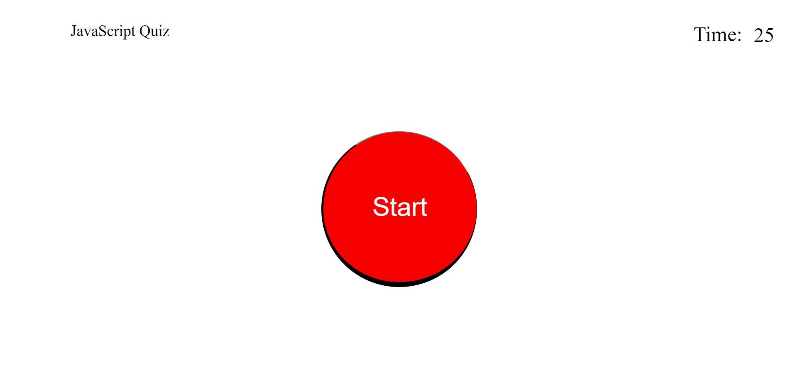
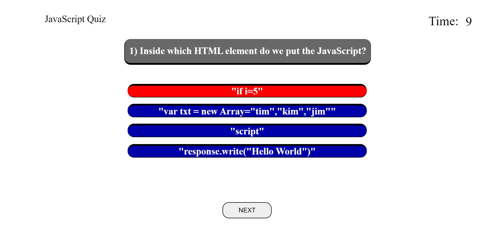
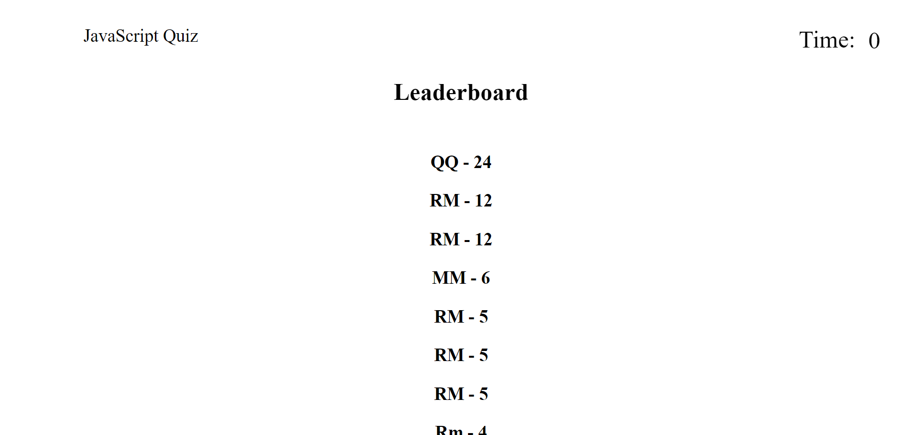

# Javascript Quiz

## This is a website made to test the understanding of javascript in it's basic form.

### Check out the live website at https://robertmcshinsky.github.io/Module-04-Challenge/

### This is the start page and as you can see, you will have 25 seconds to answer as many questions as possible.

#### If you get a question wrong, 5 seconds will be taken from your time, and if you get a question right, then 3 seconds will be added to your clock!

